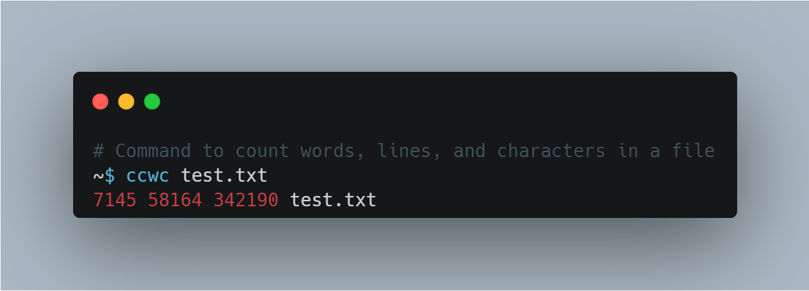

## ccwc - Coding Challenge Word Count

[](https://goreportcard.com/report/github.com/cmedina-dev/ccwc) [](https://codecov.io/gh/cmedina-dev/ccwc) 



## What is ccwc?

ccwc is a command-line interface (CLI) program which can count the number of
bytes, characters, words, or lines for a given input.

## Requirements

* Go 1.22

## Installation

Clone the directory with:

```bash
git clone https://github.com/cmedina-dev/ccwc.git
```

Then build the source files:

```bash
cd ccwc
go build
```

## Usage

ccwc may be used either by reading directly from a file, or by accepting input from Stdin.

```bash
# Read directly from a file
~$ ccwc -l test.txt

# Pipe standard input
~$ cat test.txt | ccwc -m

# Omitting flags will act as -l, -w, -c
~$ ccwc text.txt
```

ccwc accepts four different flags.

```bash
# Print the amount of bytes
~$ ccwc -c test.txt

# Print the amount of lines
~$ ccwc -l test.txt

# Print the amount of words
~$ ccwc -w test.txt

# Print the amount of characters
~$ ccwc -m test.txt
```

## License

This project is licensed under the MIT License - see the LICENSE file for details

## Acknowledgements

* John Crickett for inspiring this challenge with his Weekly Coding Challenges (https://codingchallenges.fyi/)
* terraform-docs for inspiring the README.md layout (https://github.com/terraform-docs/terraform-docs)
* Carbon for the image preview file (https://carbon.now.sh/)